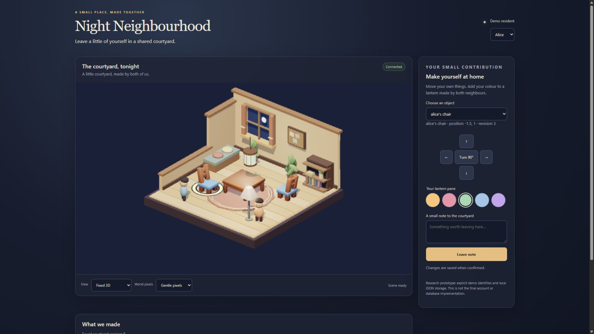

# 夜间居民区：整体设计与实施方案

2026-10-06 · 研究与规划交付版。推荐方案已经有局部运行原型；正式 A3 应用、账号系统、SQLite/Fly 部署和真人试用尚未实施。

## 1. 推荐的方向

做一个给 **6–8 位已有关系的朋友**使用的私人夜间居民区：每个人拥有一扇窗和一个可布置的小房间；大家在楼下共同维护一个小院。它既能在同时在线时即时响应，也能让隔几个小时回来的人看到朋友留下的真实改变。

推荐采用 **固定正交视角的真实 3D + 适度像素化 + 原生网页操作面板**。这满足“看起来像温馨的假三维”的视觉目标，也允许真实灯光、家具旋转与持续增加模型。现成 Three.js 和 CC0 模型承担渲染与资产基础；我们负责空间规则和有意义的社交机制。

项目的识别点是 **共造小院**：公共物件由不同朋友各自拥有的小部分组成。例如一盏灯的不同灯片、一面欢迎旗的不同方格。一个人先做也能得到完整反馈；朋友后来补上自己的部分，同一件东西就发生了可理解的变化。系统不用催促人每天签到，也不把在线时间变成贡献排名。

设计立场也参考了为熟人制作软件的small-web实践和LumiTouch的轻量光表达研究：规模小不是缺点，但共同物件能否承载意义、是否造成回应压力必须试用。来源及反例见[小规模软件与共在](../../research/night-neighbourhood/05-small-web-and-presence.zh-CN.md)，不把这些研究当作本项目效果已证实。

这是一项设计假设，不是已经证明的“全网首创”。gogh 已有多人房间、共同专注、照片和自定义物件；Rooms 已有大量 DIY；Kind Words 2 已有温柔的城市交流。我们的探索重点是：**小圈子、可辨认的个人贡献、跨时间共同制作、可重访与可撤回的空间记忆**，能否组合成值得朋友回来的一种体验。[gogh 官方更新](https://steamcommunity.com/app/3213850/announcements/)、[Rooms](https://things.inc/rooms)、[Kind Words 2](https://store.steampowered.com/app/2118120/Kind_Words_2_lofi_city_pop/)

## 2. 什么算“好”

| 用户可观察的承诺 | 对设计的约束 | 验证办法 |
| --- | --- | --- |
| 第一次进入，很快知道这里是谁的地方、自己能做什么 | 邀请预览说明小圈子；先选窗，再完成一个小贡献 | 陌生于项目的真实使用者进入并口述，不由开发者代操作 |
| 我的房间像“我的”，而且不会被朋友随手改掉 | 自己的房间由自己编辑；参观与编辑分开 | 两身份实际请求，越权写入应被服务器拒绝 |
| 共同物件能看出每个人做了什么 | 作者名按需显示；每人改自己的部分；未贡献也可以观看 | 两人分别制作、刷新、隔日回来；解释变化来源 |
| 不同时在线，也能接上朋友留下的东西 | 保存语义状态；回访显示少量空间变化；不伪造在线 | 独立新会话读取，关闭服务器后恢复，再次部署验证 |
| 手机上仍能完成核心动作 | 对象列表、方向按钮、旋转与撤销；编辑区就近出现 | 390×844 浏览器检查，加一台真实手机试用 |
| 网站不要求精确点击小小的 3D 物体 | 同一操作有 DOM/键盘路径；选中状态同时有文字和视觉反馈 | 完全不用画布完成一次布置和贡献 |
| 房间可以随以后更新继续存在 | 稳定资产 ID/版本；保存的是选择和位置，不是整段场景代码 | 老存档打开新目录，缺失模型占位并提示，迁移可回退 |

“更温暖”“朋友更亲近”“更愿意回来”需要真人研究，不能由帧率或 agent 打分推导。第一轮真实试用关注理解、表达和压力；长期留存是之后的问题。

## 3. 一次完整的使用体验

**第一晚。** 初版由运营者预置一栋小楼。林用创建者邀请领取主持人身份，给它起名，然后邀请朋友。她先获得一扇窗，选一个房间基础配色，在窗边放一盆植物。楼下本来就有一盏完整的中性灯，她给自己的灯片挑了暖粉色，并写下“今晚搬完家了”。一个人的贡献也成为完整而好看的选择，不表现成还欠朋友几片。空窗保持正常建筑装饰。普通居民不需要创建自己的服务器或新居民区。

**同一晚。** 好友用邀请进入，预览小楼名称和内容可见范围；兑换邀请之前不显示成员名单和私人内容。他先保存系统将在入驻请求中使用的新恢复码，再选择昵称和头像预设，领取剩余的一扇窗。他看见灯上的那片颜色，添上自己的薄荷色。两边都自动出现更新；鼠标悬停或对象详情解释“林 / 你分别留下了什么”。两人可以一边观察对方刚改出的整体效果，一边调整自己的部分；这段实时共造和隔时接续分别做真人验收。

**第二天。** 另一位朋友从手机回来，在小院看到灯多了一个部分，打开“自上次查看后的变化”只看到几条有意义的修改。她选择查看、做一点、或者安静离开。窗里的家具不会因为人没上线而枯萎、熄灭或被罚。

**某个值得记住的晚上。** 任一成员为共同物件创建一个命名纪念版本，例如“搬家第一晚”。档案记录当时的语义选择和作者；作者以后撤回自己的内容时，旧档案同步显示“这部分已收起”，不会用截图继续保留被撤回的文字。实时物件可以继续编辑。

## 4. 初版边界与之后的成长

初版不是空洞的房间展示：它包含身份、邀请、个人空间、有限编辑、共同创作、实时更新、重访、历史、恢复和小圈子管理这一条完整链路。

| 初版必须完成 | 初版有余力才做 | 后续持续开发 |
| --- | --- | --- |
| 私人居民区，最多 8 个成员/房间 | 16×16、8 色个人像素海报 | 更丰富海报、按需审核与导出 |
| 昵称、少量完整头像预设、可保存恢复码 | 房间第三个布局预设 | 身形/发型等模块化头像，经过 rig 验证 |
| 个人窗、房间配色、12 个必要物件；质量允许再扩至 24 | 桌面物件槽和更多配色 | 同风格家具与主题目录持续追加 |
| 网格移动、90° 旋转、移除、撤销、保存状态 | 拖动和放置预览增强 | 受控房间结构组合与更多空间 |
| 共同灯与欢迎旗两个模板，每人拥有一个可编辑部分 | 静态合影导出，先明确作者同意 | 共同设计配方、小院活动与季节主题 |
| 小圈子可见的短注释、贡献来源、命名纪念版本 | 自愿“方便聊天 / 安静待着”状态 | 私信、礼物等各自独立验证的能力 |
| 重连/冲突反馈、权限/退出/内容撤回、备份恢复 | 环境音，默认关闭、明确启动 | 可授权音景、跨时区光照与轻仪式 |

房间初始用 8×8 逻辑格、每房最多 30 件物品。这是控制编辑规则和开发成本的**产品上限**，不是已经测得的服务器或 GPU 容量。不要在第一版加入任意上传模型、自由建筑、开放陌生人广场、实时语音/视频、复杂物理、经济系统或全套社交 feed。它们可以成为以后独立设计的能力，不占据这条核心流程。

范围有两个明确交付层级：**Core（条件性约50h）**包含身份/邀请/恢复、个人窗与一间房的地面目录编辑、共造灯、所有权/撤回、实时重连/冲突、重启重部署保存、手机与键盘以及课程材料；一个布局、目录先6件，按进度到12。**Full（约78h目标）**在Core之后增加欢迎旗、整个命名纪念能力及撤回联动、丰富回访提示、墙面槽和运维细节。Core不创建档案/旗块的数据表、命令或UI；其README不承诺延期项。上表“初版必须”指Full目标。50h和78h均未经完整实现验证，D2基础闭环不过时延长迭代或缩减内容，而不是保证可完成。

## 5. 为什么选这条图形路线

Kind Words 2 的开发者确认项目使用 Unity，并曾从 Unity 2022 迁至 Unity 6；没有足够证据确认其相机、几何或制作工具。因此“假三维”在这里是你的视觉描述，我们不把它当作该游戏的已核实实现。[开发者更新](https://steamcommunity.com/app/2118120/allnews/?l=english)

| 路线 | 能得到什么 | 真正需要自己做什么 | 本次决定 |
| --- | --- | --- | --- |
| Three.js 固定正交 3D | 清楚的娃娃屋式纵深、真实灯光、现成 glTF 家具、多朝向 | 场景布局、网格/槽位规则、UI、社交数据 | 首选；已有实际模型和浏览器原型 |
| 同场景有限轨道/透视 3D | 更强的空间探索和观赏感 | 遮挡、相机约束、手势与滚动冲突、角度下的放置检查 | 未来“查看房间”选项，初版不作为必须操作 |
| 二维等距 / 预渲染图块 | 手工像素细节容易控制，画面像可编辑的等距插画 | 多方向素材、遮挡排序、灯光表现、坐标转换 | 可行的备用视觉路线，不需要更改社交语义状态 |
| Needle + 协作模板 | 编辑器导出、交互/物理/网络组件可直接作为起点 | 自建服务配置、应用权限、存档语义、许可核验 | 最有价值的工具备选；尚未做同规格本地试验 |
| Spline 编辑器 + 导出 | 快速搭场景，界面化控制状态和事件 | 导出权限/保真问题、自有后台和 DIY 校验 | 适合美术草图；全离线自托管导出需 Enterprise |

Three.js 是浏览器库，不是收费“3D API 服务”。服务器不需计算每帧画面：它保存家具 ID、位置、颜色和贡献；每个浏览器根据这些信息绘制。固定相机可以看起来像插画，仍然拥有真正的三维物体与光照。[正交相机](https://threejs.org/docs/pages/OrthographicCamera.html)、[GLTFLoader](https://threejs.org/docs/pages/GLTFLoader.html)、[Needle 模板](https://engine.needle.tools/docs/reference/templates)、[Spline 自托管导出](https://docs.spline.design/exporting-your-scene/web/exporting-as-self-hosted-project)

当前原型采用低分辨率场景再近邻放大，网页文字保持清晰。低多边形模型加像素边缘不会自动等于精心制作的像素美术；正式视觉需要调色、轮廓、物件比例和灯光迭代。二维备选也已经做了等距 SVG 草图，但它使用不同的插画资产，不能把观感差异全部归因于渲染器。

## 6. 已经验证的局部实现

本图是工程验证场景，家具来自 KayKit；它还不是最终的整栋居民楼外观。正式版需要加上“楼外窗群 → 自己的房间 → 共同小院”的空间层次，不能把这一间屋子直接当成完整居民区。

- 实际下载并加载椅子、桌子、落地灯 3 个 glTF 模型和纹理；8 个源文件合计 62,941 字节，来源固定到作者仓库 commit。架构外壳、植物、住户和灯笼是原型程序几何。[资产清单](../../prototypes/visual-comparison/assets/kaykit/ASSET-MANIFEST.json)
- 固定/轨道 3D 共用模型、语义状态和操作；二维草图也接同一状态。1920×1080 与实际核对的 390×844 CSS 视口均有截图；后者是桌面模拟手机布局。
- 两个浏览器身份共同改变灯片，一端修改会自动出现在另一端；保存改动经历本地服务器重启仍存在。
- 原型规则测试覆盖所有权、版本冲突、重复命令、碰撞和 JSON 恢复。独立审查发现并修复了公共灯不可选、固定家具穿模和加载前按钮异常。
- 390×844 中没有水平溢出；颜色按钮已改为 44×44；通过对象列表和键盘完成家具移动并在另一会话看到结果。

本地小场景不能证明正式账号授权、SQLite/Fly 重部署、真实手机 GPU、触摸手势或真人偏好。细节、原始记录与未运行项在[验证结果](../../evaluation/RESULTS.zh-CN.md)，不要把“demo Alice/Bob”当作最终安全身份。

## 7. 技术、可维护性与运营

推荐一个Node服务同时提供前端、同源HTTP命令和 **SSE授权全量快照**，SQLite存在Fly持久卷。这个小圈子需要正确保存和自动看见结果，没有连续物理运动；延续已跑通的传输路线能减少同步代码。Socket.IO是后来确有双向高频交互时的备选，Full增加档案/旗块不要求换网络层。正式仓库未知，先查看清单、脚本、CI和provision；若已有合适实时栈则比较保留成本。JSON演示存储和客户端actor值不能进入生产身份设计。

最有价值的复杂性位于 **共享状态正确性**：同一个操作重试不能做两遍；两个标签页改同一件家具时要说明冲突；被移出居民区的人不能靠旧 socket 继续改；重连不能漏掉“最后一个变化”；服务器只在数据库提交以后告诉用户保存成功。

场景、美术目录、领域规则和网络分别拥有清楚接口。两套渲染器读取同一种房间/物件语义；共同灯片与欢迎旗使用固定模板，但不是把任意 HTML/代码交给用户。以后追加物件主要是目录和经验证的资产，而不是不断改所有数据表。

单 Fly Machine + 单卷很适合这次范围，但没有自动高可用。部署维护窗口、SQLite 一致性备份和从备份恢复需要真实演练；同一个卷上的副本无法抵抗卷丢失。`release_command` 访问不到持久卷，迁移应在挂载完成后的启动阶段进行。具体架构与故障时序见 [SYSTEM-DESIGN](SYSTEM-DESIGN.md)。[Fly volumes](https://docs.fly.io/volumes/overview)、[Fly 配置](https://docs.fly.io/reference/configuration/)

## 8. 两周怎么做成

| 相对开发日 | 可交付的切片 | 通过后再做什么 |
| --- | --- | --- |
| D1–2 | 首6h内概念试用；实际仓库；身份/邀请/一个窗；可部署的保存闭环 | 产品能解释共同制作，存储和身份可用 |
| D3–4 | 一间房、12 个目录物件、服务端放置规则和撤销 | 固定布局/目录版式，不扩大编辑器 |
| D5–6 | 两人共同灯片、授权实时快照、重复/冲突/断线处理 | 实时共造与“另一人后来接上”完整成立 |
| D7–8 | 楼外窗群与小院整合、回访变化、欢迎旗复用 | 体验有居民区层次，而不是 demo 控制台 |
| D9–10 | 命名纪念版、撤回/退出、成员管理、备份恢复 | 证明旧档案与权限同步变化 |
| D11–12 | 真实朋友试用、手机/键盘修正、弱设备画质路径 | 根据发现修正流程，不凭感觉追加功能 |
| D13–14 | 重启/重部署验证、日志、最终证据/写作与缓冲 | 完成课程检查和实际验收，不再扩范围 |

这估计按个人约 70–85 小时有效开发时间分配，含整合与问题修复；没有把三个并行 agent 当成三位真人开发者。若每天可投入时间更少，一个布局、6件地面物品和共同灯是Core范围，像素海报、环境音与第三布局暂缓。精确任务、验收和减项顺序在[交付与验证](DELIVERY-AND-VALIDATION.zh-CN.md)。

课程正式截止是 2026-11-09 中午 12:00 堪培拉时间，约两周是你的工作预算。C8 为 proof of life，C9 推进实时，C10 加服务器日志；实际日程执行前复核课程页面。作业是个人项目，朋友参与试用不意味着共同提交代码。[Final brief](https://comp.anu.edu.au/courses/comp4020-agentic-coding-studio/assessments/final-project/)

## 9. 以后怎么持续更新

1. **内容更新**：同一艺术规范下每次加 4–6 件主题物件；先检查 scale/pivot/footprint/许可与旧存档，目录版本递增。早期就保留兼容元数据。
2. **共同制作更新**：先增加一个有不同贡献结构的模板，例如花架或节日窗贴；验证 author/slot/撤回/纪念版接口是否真能复用，再抽象“配方系统”。
3. **更丰富表达**：像素海报、受控配色、头像附件；模块化人物等 rig 与裁剪稳定后才上。每次都保持手机文本操作路径。
4. **有价值的生活场景**：考试周共同的小目标、朋友搬家纪念、生日窗灯等自愿仪式。先用现有物件语义做，不先引入复杂日历或任务经济。
5. **规模增长**：观察实际数据库锁等待、消息量与场景资源后才讨论多机/多卷；这属于新部署架构，不是在单卷方案上假设自动扩容。

没有每日产出义务、排名或“朋友不来所以东西坏了”的机制。它可以被长期开发成朋友的共享小地方；验证重点始终是空间是否承载了关系，而不是能否无限增加装饰。

## 10. 文档与证据导航

- [体验、交互、美术与 DIY](EXPERIENCE-AND-DIY.zh-CN.md)：窗群、房间、小院、移动端、目录和素材管线。
- [系统设计](SYSTEM-DESIGN.md)：权限、数据、命令、事件、持久化、恢复、删除和运维。
- [交付与验证](DELIVERY-AND-VALIDATION.zh-CN.md)：可执行切片、课程映射、测试、真人研究和发布准备。
- [图形与工具研究](../../research/night-neighbourhood/01-graphics-and-tools.zh-CN.md)、[资产与 DIY 研究](../../research/night-neighbourhood/02-assets-and-diy.zh-CN.md)。
- [产品与原创性研究](../../research/night-neighbourhood/03-product-and-originality.zh-CN.md)、[实时与持久化研究](../../research/night-neighbourhood/04-realtime-and-persistence.zh-CN.md)。
- [小规模软件与共在研究](../../research/night-neighbourhood/05-small-web-and-presence.zh-CN.md)：设计立场、轻表达与期待回应的反例。
- [实验与评审结果](../../evaluation/RESULTS.zh-CN.md)、[继承记录](../../reference/INHERITANCE.md)。

待执行阶段确认的事实只有少数：实际 A3 仓库/provision、可用有效工时、至少一个真实手机和愿意参加小试用的朋友。推荐不依赖购买素材或第三方社交账号；这些事实到位后即可按 D1 切片推进。
