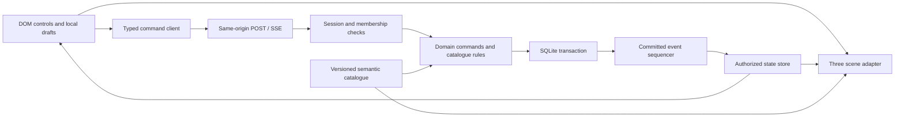

# Night Neighbourhood: system design

Status: implementation plan, 6 October 2026. The production assignment repository,
its manifest, CI, Fly configuration and installed database binding have not yet
been inspected. This file specifies a recommended implementation; it does not
claim that the application or its production guarantees already exist.

## Capability and release boundary

An invited friend can shape one personal window and room, contribute an identifiable
part to a shared courtyard object, leave, and return to the persisted changes made
by their circle. Friends may contribute together or hours apart. Each person keeps
control of their own contribution. The scene gives these changes a visible place;
the database owns their meaning independently of the scene renderer.

The Core plan targets roughly 50 hours of implementation; Full targets roughly
78 hours including its extensions. Both are conditional estimates, and identity,
deployment and device checks can increase them. The Core first slice supports one
private circle, a target of six to eight invited
pseudonymous residents, at most eight rooms, one courtyard, and one shared lantern
string. A room uses an 8-by-8 logical floor
and permits at most 30 movable objects. Start with one room preset and six useful
floor objects, then grow to 12 after the full loop works; a 24-object catalogue is
a Full expansion. These are scope limits, not measured
server or GPU capacity. They can be lowered without deleting existing content.

The core MVP includes invitation and recovery, one owned room per resident, preset
avatar and room choices, validated floor placement and quarter-turn rotation,
per-author lantern panes, a short circle-visible note attached to an authored part,
own-part retraction, reconnect and persisted restart recovery. Wall/tabletop sockets,
the second shared template (a tiled banner), and archive UI are gated extensions
after the Core loop passes its checks; their work belongs to the roughly 78-hour
Full plan. Core implements no archive table, archive command or archive UI. Full can
add the banner and archive schema/UI without changing a working realtime transport.
When archives are enabled, bounded retention, deletion and authored-fragment
redaction ship with them; they are not deferred privacy repairs.
The fixed orthographic camera is the default. Orbit inspection is a possible later
mode, not a requirement for editing.

Private inbox messages, gifts, live chat, free walking, voice/video, arbitrary model
uploads, a marketplace, public discovery, multiple circles per account and third
party authentication are later capabilities. There is no inbox UI or inbox table
in the MVP. The private-stream boundary below describes how such a feature must be
added without exposing it through a circle stream.

All room arrangements and authored notes in a circle are visible to its current
members. "Personal room" means personal authorship, not confidential room contents.
Connection status and a deliberately chosen availability signal are separate:
being disconnected does not make a stored lamp go dark. Availability is an opt-in,
short-lived lease, never a persisted last-seen timeline.

## Recommended stack and evidence

| Layer | Choice | Reason and verification before adoption |
| --- | --- | --- |
| Runtime | Supported Node LTS, provisionally Node 24 | One JavaScript/TypeScript runtime for server, contracts and tools. Pin a supported patch in the actual course repository and Docker image. The local prototype ran on Node 24.15.0; this is not a production pin. [Node release policy](https://nodejs.org/en/about/previous-releases). |
| HTTP | Express 5 | Small same-origin API and static delivery. Inspect an existing server before replacing it. Express 5 requires Node 18 or later and has compatibility changes from Express 4. [Migration guide](https://expressjs.com/en/guide/migrating-5/). |
| Realtime, Core | Authorized HTTP POST commands and SSE whole snapshots | A small one-way state feed paired with ordinary mutation requests. Native EventSource supports server events and reconnection; this application sends the latest complete authorized state on every connection rather than depending on event replay. [HTML SSE standard](https://html.spec.whatwg.org/multipage/server-sent-events.html). |
| Realtime, optional Full | Socket.IO 4 with incremental delivery | Adopt only if measured traffic or a later interaction needs it. The application still owns durable delivery and identity; ordered arrival does not guarantee arrival, and default delivery is at most once. Banner/archive features alone do not justify this migration. [Delivery guarantees](https://socket.io/docs/v4/delivery-guarantees/). |
| Storage | SQLite through a pinned better-sqlite3 release | Short synchronous transactions suit a small single-process application. Confirm the binding builds in the deployed Linux image and inspect its linked SQLite version. [Binding requirements](https://github.com/WiseLibs/better-sqlite3), [API](https://github.com/WiseLibs/better-sqlite3/blob/master/docs/api.md). |
| Scene | Three.js 0.186.1 for the first spike | Already used in the local comparison. Stock orthographic camera and glTF loading cover the proposed scene; no hosted 3D API is required. Retest the dependency combination when production pins change. [OrthographicCamera](https://threejs.org/docs/pages/OrthographicCamera.html), [GLTFLoader](https://threejs.org/docs/pages/GLTFLoader.html). |
| Hosting | The assigned Fly application, one Machine and one mounted volume | A single deployment boundary for HTTP, realtime and SQLite. Volume storage is local to its host and is not automatically replicated. [Fly Volumes](https://docs.fly.io/volumes/overview/). |

Use the actual repository's package manager, language conventions and required
commands. A React wrapper is optional, not a prerequisite for Three.js. If the
course checkout already has a suitable Fastify or other server, preserve it unless
a concrete incompatibility justifies a change. Do not run historical A2 commands
or replace the course deployment template on the strength of this proposal.

## Module boundaries



Proposed source responsibilities, adjusted to the real checkout layout:

| Module | Owns | Must not own |
| --- | --- | --- |
| `shared/contracts` | Validated command, response and snapshot schemas; error codes; schema version | Cookies, renderer objects or database handles |
| `shared/catalogue` | Stable IDs, geometry footprints, allowed variants, sockets, static layout and collision rules | Downloaded third party code or arbitrary user URLs |
| `server/identity` | Opaque sessions, invitation exchange, recovery and membership | An identity supplied in a command body |
| `server/domain` | Ownership, placement, contributions, archive and retraction rules | Socket room names as proof of authorization |
| `server/db` | Prepared statements, transaction boundaries, numbered migrations, backup | Canvas or animation state |
| `server/realtime` | Core: authorized full-snapshot SSE, heartbeat and post-commit delivery; optional Full: delta/barrier protocol | Deciding whether an object may be edited |
| `client/state` | Latest authorized projection, ordered application, pending commands and conflicts | Optimistic changes presented as confirmed saves |
| `client/editor` | Selection, previews, catalogue browsing, nudge/rotate/undo controls | Server authority or persistent database state |
| `client/scene` | Mesh instances, lighting, picking, camera, resize and disposal | Membership, command receipt or archival logic |
| `client/accessibility` | Equivalent native controls, labels, focus and reduced-motion choices | A second independent set of mutation rules |

The renderer receives plain records. A raycast supplies a stable `placementId` or
`artifactId`; it never submits a mesh, matrix or material as persistent state.
Native object lists and nudge buttons use the same commands as canvas editing.
Rendering failure preserves readable saved state and these controls, with a clear
scene error and retry action. This does not promise an automatic second 3D engine.

## Catalogue, slots and spatial rules

A single versioned manifest is consumed by server validation and the renderer.
The client cannot invent an asset, footprint, variant or permission by modifying
its local JSON. A catalogue entry contains:

```json
{
  "assetId": "furniture.chair-a",
  "assetVersion": 1,
  "modelUrl": "/assets/chair-a.v1.glb",
  "contentHash": "sha256:verified-at-build",
  "sourceRecord": "kaykit-furniture-bits-1.0/chair_A",
  "licenceRecord": "assets/licences/kaykit-cc0.txt",
  "footprintCells": [1, 1],
  "allowedYaw": [0, 90, 180, 270],
  "surface": "floor",
  "variants": ["natural", "sage"],
  "placementLimit": 30,
  "sockets": []
}
```

The hash and filenames above illustrate fields, not existing production values.
Store actual provenance and hashes at asset ingestion. Assets may share texture
atlases; a whole-mesh tint is not a promise that fabric and wood can be recoloured
independently. Only prepared catalogue variants appear in the UI.

The room template defines eight logical cells per axis, a fixed coordinate origin,
wall and door exclusions, immutable dressing footprints, editable floor cells and
named wall sockets. Use integer half-cell coordinates for floor placement to avoid
floating-point disagreement. Convert to renderer metres in one adapter. Rotate
rectangular footprints for 90/270 degrees and validate against current occupancy,
the room boundary and fixed obstacles inside the committing transaction.

Begin with floor placement only. Named wall sockets are a later, separately checked
extension. Tabletop decor, when enabled, attaches to an
approved named socket on a parent placement, not arbitrary y-coordinate dragging.
If tabletop sockets are included, the child stores `parentPlacementId` and
`socketId`; the parent owns both, occupancy is unique per socket, and deleting the
parent withdraws its children in the same transaction. Unsupported items are
hidden from that catalogue category until the socket contract is implemented.

An invalid preview stays local and shows its reason. Only a successful command
makes it durable. Moving or rotating a parent cannot violate a child's rules.
Static dressing uses this same manifest: the research prototype originally allowed
a plant to intersect its fixed sofa because validation considered only editable
furniture. The corrected prototype adds fixed obstacles to the domain check; the
production design makes this agreement structural rather than visual guesswork.

## Actors and permissions

| Action | Public demo visitor | Invited resident | Circle host | Operator |
| --- | --- | --- | --- | --- |
| View saved private circle | No | Current circle only | Current circle only | No routine content access through a product UI |
| Edit room configuration / objects | No | Own room only | Own room only | No routine authorship powers |
| Add/edit/retract an artifact part | No | Own part only | Own part only | Operational redaction only through an explicit maintenance procedure |
| Read a circle-visible part note | Demo fixture only | Yes | Yes | Not logged |
| Create an artifact archive, when enabled | No | Yes, once per artifact/occasion | Yes, same rule | No normal content action |
| Delete an artifact archive, when enabled | No | Own created archive only | Any circle archive | No normal content action |
| Edit somebody else's part or note | No | No | No | No normal content action |
| Hide inappropriate shared content | No | No | Yes, suppress and redact the affected part; do not rewrite it | Only when required for maintenance and recorded |
| Invite, revoke invitations, remove a member | No | No | Yes | Recovery administration only |
| Delete own authored data / recover own identity | No | Yes | Yes | No impersonation endpoint |
| Deploy, migrate, backup and restore | No | No | No | Authorized maintainer only |

The host manages membership and moderation, not every edit. Each resident gets a
unique owned room. The lantern and later banner templates allocate at most one authored
slot per resident per artifact. A resident may start alone; additional members add
their own slots without a quorum or a host approval step. The host can transfer
hostship to an active member. A host cannot leave or delete their identity while
other active members exist until transfer succeeds. The final host can explicitly
delete the circle; this removes its private content and membership grants.

All API reads and mutations resolve the actor from the current server session.
Core checks each POST, protected GET and SSE subscription; active subscriptions
are revalidated on delivery/heartbeat and cancelled on revocation. If Socket.IO is
adopted in Full, its rooms are routing groups, not access control. Its middleware runs once
per connection, so membership must also be checked for each command and protected
read. [Rooms](https://socket.io/docs/v4/rooms/), [Middleware](https://socket.io/docs/v4/middlewares/).

## Identity, invitations and recovery

1. The operator initially provisions one circle and a one-use host invitation. This
   is a deliberate bootstrap action in the actual environment, not a public
   create-unlimited-circles endpoint.
   The invited host can name the already provisioned circle through an authorized
   `circle.configure` command; ordinary residents cannot create additional circles.
   Before assessment, reserve two of the eight member/room slots and have the host
   issue two distinct resident invitations, with validity covering assessment and
   the next-day return task. Deliver them privately through the course-approved
   access/submission instructions, not public Git/CI/logs. `/readme/` links to the
   invite exchange form. Rehearse with two separate temporary invitations and
   identities, then remove those test memberships and revoke unused rehearsal
   grants. Leave the final two assessor invitations UNCONSUMED with two free
   slots at submission; do not spend them in the rehearsal. Use only
   consented or synthetic circle contents, and revoke/remove assessment grants
   explicitly afterwards. The immutable demo is not a write-test substitute.
   This is a future delivery procedure; no invitations were sent by this research.
2. A host makes a high-entropy, expiring, single-use invitation. Store its digest,
   circle, expiry and consumed/revoked state. Invite preview reveals a chosen circle
   label and an explanation, not member names, notes or room contents.
3. Before sending an invitation or recovery exchange, the browser generates a new
   32-byte recovery key using Web Crypto and an exchange UUID. Show the replacement
   key and ask the resident to save it in their own recovery download/copy before
   transmitting. Keep it only in request memory, not the ordinary draft store. The
   request contains the exchange ID, old invitation/recovery credential and the
   generated replacement key. The server stores only digests. This order ensures
   that a committed exchange cannot lose its only usable key with the response.
   [Web Crypto random values](https://developer.mozilla.org/en-US/docs/Web/API/Crypto/getRandomValues).
4. Exchange the invitation through a same-origin POST. In one transaction consume
   it, enforce eight active memberships, create a resident and membership, allocate
   an empty physical room slot, install the replacement-key digest, write an
   identity-exchange receipt, and advance the saved circle sequence. Record separate
   join metadata only if Full history is enabled. Concurrent use by different
   exchange requests produces one success. An exact replay proves knowledge of the
   replacement key, matches the stored request digest and current recovery
   generation, and issues a fresh session without allocating another identity or
   room. Never authorize replay using a consumed invitation alone.
5. Issue a random opaque session cookie; the database stores only its digest. On
   production HTTPS use `__Host-nn-session`, `HttpOnly`, `Secure`, `SameSite=Lax`,
   `Path=/`, and no `Domain`. The local development cookie is explicitly separate.
   Cookie attributes have specific browser semantics, not an XSS defence for all
   application state. [Set-Cookie reference](https://developer.mozilla.org/en-US/docs/Web/HTTP/Reference/Headers/Set-Cookie).
6. An invitation joins a circle; it does not recover an existing identity. A display
   name is not a credential. Recover by the rate-limited exchange above. In one
   transaction verify the old key, increment the recovery generation, revoke old
   sessions, install the already-saved replacement digest and record the receipt.
   Replay of that same exchange uses the replacement-key proof and matching current
   generation, issues a session without rotating again, and leaves this
   generation's previously issued replay sessions valid so reordered responses
   cannot install an already-revoked cookie. A later genuine rotation makes every
   earlier exchange replay invalid. Retain replay receipts for 30 minutes; after
   expiry, the saved replacement key can perform a new normal recovery. A removed
   membership stays removed after recovery. Without a saved key or surviving
   session the MVP cannot identify the former resident; explain that limit plainly.

The exchange receipt binds its type, old-credential digest, replacement digest,
canonical request digest, resident and resulting recovery generation. Successful
receipt lookup occurs before attempting to consume the old credential again, but
always verifies replacement proof and current generation. The session row and
exchange outcome commit atomically. Do not log the exchange body. Test loss of the
first response, repeated concurrent identical requests, reordered responses, and
replay after another recovery rotation. This is a separate identity protocol from
ordinary content command receipts.

Generate bearer secrets from at least 32 random bytes and UUID command IDs with the
runtime's cryptographic functions. A digest is appropriate for these generated
high-entropy tokens; if human-chosen passwords are introduced later, this is not
their password-storage design. [Node crypto](https://nodejs.org/docs/latest-v24.x/api/crypto.html).

Adopt a 30-day session lifetime with bounded renewal after real authenticated
activity. Logout revokes that session. "Log out all devices" and recovery revoke
all sessions. The session policy is a product choice, to be tested rather than
silently inherited from a framework.

Check exact permitted Origin for cookie-bearing HTTP mutations, reject unexpected
content types, and include a session-bound CSRF token
on HTTP mutation routes. `SameSite` is a complementary layer. Check Origin on the
actual upgrade/connection path if the optional Socket.IO mode is introduced, not
merely an HTTP CORS header. SSE remains same-origin and cookie-authorized. Never put invitation
or recovery tokens in logs, telemetry, referrers or public link previews. A manual
invite code or fragment-based invite link is exchanged and then removed from the
address bar; use `Referrer-Policy: no-referrer`. [OWASP CSRF guidance](https://cheatsheetseries.owasp.org/cheatsheets/Cross-Site_Request_Forgery_Prevention_Cheat_Sheet.html).

Use prepared statements, bounded request bodies and plain-text notes. Render notes
with text APIs, not HTML insertion. CSP permits only the application's necessary
assets and connections. No user-provided model URL, script, iframe or HTML is
executed. Proposed initial limits are a 16 KiB command body, 140 Unicode code points
per part note, a modest per-session command token bucket, and tighter invite/recovery
limits combining token digest and short-lived request origin information. Return a
generic recovery failure rather than exposing whether a resident exists. Tune
numeric request limits from actual use; do not treat IP as resident identity.

## Logical database schema

This schema covers Core plus the gated Full extensions. Core has no archive table
or event-history table. Create the archive table and its commands only when that
extension is enabled; the lantern
does not need an occasion/calendar lifecycle to function.

Use foreign keys, explicit `CHECK` constraints, prepared queries and numbered
migrations. UUIDs are opaque row IDs; timestamps are server-generated UTC. Revisions
and stream sequences are nonnegative integers. Use one database connection and
one Node process initially. Do not perform network I/O inside a database transaction.

| Table | Essential columns and constraints |
| --- | --- |
| `schema_migrations` | `version PK`, migration checksum, applied UTC; refuse altered applied migrations |
| `circles` | `id PK`, label, `host_resident_id`, status live/quarantined, `revision`, `stream_seq`, `privacy_epoch`, created UTC; exactly one provisioned live circle initially |
| `residents` | `id PK`, display name, preset avatar ID/version, recovery digest UNIQUE, recovery generation, deleted UTC; no email, password or last-seen column |
| `sessions` | `token_digest PK`, resident FK, recovery generation, created/expires UTC, revoked UTC; index resident and expiry |
| `memberships` | `(circle_id,resident_id) PK`, status active/removed/quarantined, membership revision, joined UTC; room allocation occurs with active membership creation |
| `invites` | `token_digest PK`, circle FK, created-by FK, expiry, consumed UTC/resident, revoked UTC; host-only listing without plaintext tokens |
| `identity_exchanges` | `exchange_id PK`, type join/recover, canonical request digest, old/replacement credential digests, resident FK, resulting recovery generation, expiry; replay creates sessions only while the generation remains current |
| `rooms` | `id PK`, circle FK, physical slot 0..7, nullable owner FK, allocation generation, template ID/version, approved palette, arrangement revision, configuration revision; UNIQUE(circle,slot), UNIQUE(circle,owner) |
| `placements` | `id PK`, room FK, asset ID/version, variant ID, integer x/z half-cells or parent/socket, quarter-turn yaw, revision; ownership derived from room; mutually exclusive floor/socket forms |
| `artifacts` | `id PK`, circle FK, template lantern/banner, template version, revision; start with one live lantern, add one live banner only when enabled; no occasion column |
| `contributions` | `id PK`, artifact FK, author FK, slot ID, validated JSON content, plain-text note, revision, suppressed/retracted UTC; UNIQUE(artifact,author), UNIQUE(artifact,slot) |
| `archives` (Full only) | `id PK`, artifact FK, client occasion UUID, creator FK, immutable title, source artifact revision, create-intent hash, frozen semantic projection JSON, archive revision, privacy epoch, deleted UTC; UNIQUE(artifact,occasion); at most ten non-deleted rows per artifact |
| `events` (optional Full history/delta mode) | `(circle_id,seq) PK`, privacy epoch, kind, entity ID/revision, author ID where permitted, command ID, created UTC; metadata only, no note text or secret tokens |
| `command_receipts` | `(resident_id,command_id) PK`, circle ID, canonical request hash, outcome metadata, resulting revisions and sequence; no submitted note text or bearer secrets |

Index Core placements by room, contributions by artifact and author, and memberships
by resident/status. Full indexes archives by artifact/occasion. If event history is
introduced, its primary key serves ordered catch-up and a timestamp index supports
retention cleanup. Composite
relationships must prevent cross-circle linkage. An artifact archive's embedded
fragments include stable author/contribution IDs so they can be redacted later.
Catalogue content is shipped in the build, not an editable database of arbitrary
remote asset URLs.

Provision eight physical room slots. An active member owns one; unallocated slots
have no owner. Removal clears and redacts the old slot's contents and increments
its allocation generation before it becomes reusable. Room commands also bind
that allocation generation, so an old pending command cannot affect a reassigned
room. This bounds both visible rooms and stored room slots at eight; removed
memberships remain minimal authority tombstones, not additional hidden rooms.

Retain compact successful command receipts for the circle's lifetime: a command ID
must never become reusable merely because a result body was pruned. Store only
small outcome metadata, and monitor table size. If Full event history is enabled,
retain event metadata for the latest
10,000 events or 30 days, whichever is smaller; older cursors receive a full snapshot.
These are initial operational policies, not implemented jobs. Numbered database
migrations add archive, event-history, future inbox or gift tables only when that
capability is built. Core persists its sequence directly in the circle row.

## State, command and response contracts

Persist Core room settings and placements, avatars, membership, invitations,
contribution content, entity revisions, sequence counters and successful receipts.
Persist archives only when their Full extension is enabled.
Do not persist pointer position, drag previews, orbit angle, transient availability,
socket IDs, connection status or other people's reading activity. Camera and motion
preferences remain per-device local settings. Drafts and pending commands are
separate from saved content.

If a voluntary availability control is added in Full, implement it as an
authorized in-memory lease with a proposed 90-second expiry and explicit renewal
while its owning tab is visible. Publish a separate transient `availability:update`
event, without incrementing the durable circle sequence. The latest explicit
choice wins across a resident's tabs; another tab does not renew a choice it did
not make. Expiry, last-tab disconnection, revocation and restart restore a neutral
signal. Core omits this control. Do not infer an invitation to talk from a
connection merely being open.

A saved placement is renderer-independent:

```json
{
  "id": "placement-uuid",
  "roomId": "room-uuid",
  "assetId": "furniture.chair-a",
  "assetVersion": 1,
  "variantId": "natural",
  "xHalfCells": 4,
  "zHalfCells": 6,
  "yaw": 90,
  "revision": 7
}
```

A command contains no authoritative actor field:

```json
{
  "schemaVersion": 1,
  "commandId": "1c082bd2-c9b0-4ae9-bdf4-b42e352728f9",
  "circleId": "circle-uuid",
  "type": "placement.move",
  "targetId": "placement-uuid",
  "expectedRoomGeneration": 3,
  "expectedRevision": 7,
  "payload": {"xHalfCells": 5, "zHalfCells": 6}
}
```

The example UUID identifies one intended operation. A lost acknowledgement retries
that identical envelope with that same UUID; clicking a fresh operation creates a
new UUID. Use absolute resulting positions rather than a repeatable `move +1`
side effect. A successful response contains `commandId`, `entityRevision`,
`circleSeq`, `privacyEpoch`, and whether the state changed. The response may arrive
before or after its event; the client reconciles both by IDs and revisions.

Room and placement commands bind `expectedRoomGeneration` in addition to the
entity revision. Commands for circle artifacts omit that field. A new placement
uses expected entity revision zero and names its owned room in the payload;
successful creation installs revision one. The validator rejects unknown fields.

Core and gated extension commands:

| Command family | Optimistic revision and validation |
| --- | --- |
| `circle.configure` | Circle revision, current host only, bounded plain-text label; cannot create another circle, change limits or transfer ownership |
| `room.configure` | Room configuration revision, own room, approved template/palette; template replacement with occupied rooms is not an initial user command |
| `placement.create` | Client-created placement UUID, owned room, current count and occupancy; validated catalogue version and variant |
| `placement.move`, `.rotate`, `.variant`, `.withdraw` | Placement revision, owned room, current complete layout; withdrawal redacts archived copies |
| `contribution.put`, `.withdraw` | Own slot revision, permitted template payload, plain-text note; independent authors do not contend on one artifact-wide edit revision |
| `archive.create` (extension) | Required client `occasionId` UUID and plain-text title, expected artifact revision; check authorization and stored create intent before returning a same-occasion archive; refuse an eleventh live archive |
| `archive.delete` (extension) | Archive revision and active membership; creator or host only; clear frozen content/title, keep a minimal deleted-occasion tombstone, preserve the live artifact |
| `membership.remove`, `invite.revoke`, `host.transfer` | Host authority and membership/circle revision; cannot remove or delete the last host accidentally |
| `resident.delete` | Explicit confirmation and valid session; coordinated membership, content and recovery/session removal |

The server validates limits and collisions against the latest transaction state.
Separate placement edits need not fail simply because an unrelated chair moved;
the complete occupancy check still rejects two objects choosing the same cell.
An entity revision prevents one resident's two tabs overwriting each other.

Every committed contribution update/withdrawal also increments its containing
artifact's aggregate content revision. Authors still check only their own slot
revision, so independent edits can both succeed; an archive's expected revision
refers to that aggregate content marker.

HTTP routes, names adjustable to the actual framework:

| Route | Purpose |
| --- | --- |
| `GET /api/session` | Current resident and active membership projection, CSRF bootstrap; `Cache-Control: no-store` |
| `POST /api/invites/exchange` | Replay-safe identity creation with the previously saved replacement-key digest and an issued opaque session |
| `POST /api/recovery/exchange` | Rotate recovery and sessions; never log body |
| `POST /api/logout` | Revoke current session |
| `GET /api/circles/:id/snapshot` | Authorized consistent saved projection and sequence |
| `POST /api/circles/:id/commands` | Core's authorized mutation handler with UUID receipts and revision checks; any later transport uses this same handler |
| `GET /api/circles/:id/events` | Core's authorized SSE feed, latest whole snapshot on connection and after committed changes, plus heartbeat sequence/epoch |
| `GET /api/commands/:commandId` | Current resident's compact outcome only; never an arbitrary resident receipt lookup |
| `GET /api/demo/snapshot` | Separate immutable synthetic dataset, no private-circle join or mutations |
| `GET /health/live`, `GET /health/ready` | Process liveness and mounted/migrated database readiness; no private details |

Core SSE event kinds are `snapshot`, `heartbeat` and `revoked`; mutation results are
HTTP responses. Optional Full Socket.IO names are `command`, `command:result`,
`circle:snapshot`, `circle:event`, `circle:watermark`, `circle:revoked` and
`sync:request`. If added, both mutation transports share the handler, validation,
idempotency store and rate limits; do not create a parallel mutation implementation.

Archive creation/deletion uses the existing circle command route and result/event
envelopes; there is no calendar, new recipe endpoint or recurring-event subsystem.

## Transaction, idempotency and conflicts

For every command, perform the following sequence:

1. Bound and parse its schema, resolve current session, and verify active membership.
   Recheck these inside the transaction before reading protected outcome metadata.
2. Canonicalize the allowed request fields with stable object-key ordering. Include
   schema version, circle, type, target, room allocation generation where relevant,
   expected revision and payload; the actor is
   resolved from the session. Hash this representation. Do not hash raw JSON order.
3. Look up `(residentId,commandId)`. Equal hash returns the existing outcome without
   applying another change. Different hash returns `COMMAND_ID_REUSED`. A removed
   resident does not regain access by retrying an old success.
4. Resolve target and ownership; check expected revision, catalogue version, count,
   footprint/socket constraints, limits and lifecycle rules.
5. Apply changes, increment affected revisions, allocate the next circle sequence,
   and insert the receipt in one transaction. Insert event metadata only if the
   Full history/delta extension is enabled. A harmless
   no-op may save a successful receipt without incrementing revisions or sequence.
6. Commit. Only then acknowledge or broadcast. A persistence error produces no
   successful acknowledgement and no speculative shared state.
7. Deliver to currently authorized subscriptions. Mark the client saved on the
   committed result or matching authoritative event, not merely on a preview.

The application promises one committed effect for one retained accepted command
ID, not magical exactly-once network delivery. Core retries a timed-out POST with
the same UUID because its response may be lost after commit. If Socket.IO is added,
its delivery still needs application receipts. [Delivery guarantees](https://socket.io/docs/v4/delivery-guarantees/).

`REVISION_CONFLICT` carries a safe latest entity revision/projection only if the
requester is still authorized. Keep the user's proposed edit visible as a draft;
offer "Use latest" and "Apply my change to this version". Reapplying is a new
command ID after comparing the latest state. Never auto-overwrite with a stale
draft. Terminal validation/ownership errors stay failed; network timeout stays
"confirmation pending" until retry or receipt lookup resolves it.

Use stable error codes: `AUTH_REQUIRED`, `MEMBERSHIP_REVOKED`, `FORBIDDEN`,
`INVALID_INPUT`, `CATALOGUE_MISMATCH`, `COLLISION`, `REVISION_CONFLICT`,
`COMMAND_ID_REUSED`, `RATE_LIMITED`, `STORAGE_UNAVAILABLE`. HTTP maps respectively
to 401/403/400/409/429/503 as appropriate; optional Socket.IO returns the same code envelope.
Unknown internal errors carry a request ID and a concise safe message, not SQL,
paths, stacks or secret-bearing input.

The archive extension adds `ARCHIVE_LIMIT_REACHED`, `ARCHIVE_INTENT_CONFLICT` and
`ARCHIVE_DELETED`, all 409 outcomes with a safe explanation. They never silently
rename, overwrite or resurrect an archive.

## Authorized streams and recovery

"Circle-public" means visible to that private circle's active members, not public
on the internet. Each circle has its own monotonically increasing sequence and
privacy epoch. All circle-public changes share that sequence. Session and recovery
changes are not circle-public events. There is no global sequence mixing private
and shared payloads.

### Core: complete saved projections over SSE

Use native same-origin `EventSource` with the opaque session cookie. On initial
connection and every reconnection the server authenticates the resident, verifies
current membership and sends the latest full saved projection read with its circle
sequence and privacy epoch in one consistent database read. `Last-Event-ID` is a
useful diagnostic cursor, not a promise to replay every missed event. EventSource
normally reconnects after an interrupted stream; authorization failures and explicit
logout/revocation are handled by closing it and clearing protected UI state.
[EventSource lifecycle](https://html.spec.whatwg.org/multipage/server-sent-events.html).

After a committed mutation, deliver the newest full projection to each currently
authorized subscription. Each `snapshot` contains circle ID, sequence, privacy
epoch, catalogue/schema version and all circle-visible saved state. It excludes
session/invitation/recovery material and local drafts. Rendering reads that one
replacement projection. No `snapshotApplied` acknowledgement, incremental replay,
buffer-then-flush barrier or event-history table is required for Core.

For the same current circle/authentication context, reject snapshots from a lower
privacy epoch or a sequence older than the already-applied projection. A newer
whole snapshot may safely skip sequence numbers because it includes the complete
state; a gap is not an incremental-patch failure. On a newer privacy epoch discard
the old projection before applying the new one. Treat snapshots from a departed
authentication/connection generation as stale even if their request completes
late, so a slow GET cannot refill state after logout or revocation.

Every two seconds send an authorized `heartbeat` containing the latest sequence
and privacy epoch. A newer watermark triggers an authorized snapshot GET. Also
refresh that snapshot on visible-tab resume/reconnect and every five seconds while
visible, so even loss of the final snapshot and a heartbeat cannot leave the UI
stale indefinitely. On 401/403 close the feed, invalidate pending reads and clear
protected projections; retain only permitted recovery guidance. The server removes
revoked subscriptions immediately and checks session expiry/membership before
heartbeats or content delivery. A slow client is disconnected on bounded stream
backpressure and reconnects to the latest snapshot rather than accumulating an
unbounded queue. Keep drafts separate and pending POST UUIDs stable through this.

Measure full snapshot bytes and fan-out cost with the actual bounded catalogue and
circle before expanding. Core's six-to-twelve catalogue entries, room/placement caps and
single circle make this a reasonable initial proposal; no capacity benchmark is
claimed. Banner or archive creation can publish another full snapshot using this
same transport. Full does not require a Socket.IO migration merely to add them.

### Full: optional incremental transport

The following protocol applies only if a later measured need justifies incremental
delivery. It is a blueprint for that mode, not a Core acceptance requirement.

Socket.IO's optional connection-state recovery can fail. Keep it disabled initially
to avoid duplicating recovery mechanisms; implement the durable snapshot protocol.
If enabled later as an optimization, use `skipMiddlewares:false` and retain the
application resync path. [Connection-state recovery](https://socket.io/docs/v4/connection-state-recovery/).

Initial connect and resync in this optional Full mode:

1. Authenticate, check membership, and create a subscription in `syncing` state.
   Buffer post-commit events for that subscription before taking the snapshot.
2. In one consistent database read obtain the authorized projection, catalogue
   version, privacy epoch and circle sequence `S`.
3. Recheck authorization before emission. Send the snapshot and await its client
   `snapshotApplied(S, epoch)` acknowledgement. Do not flush buffered events before
   the snapshot is applied.
4. Discard buffered events at or below `S`; deliver higher events in order and then
   set the subscription live. Bound the buffer; overflow restarts with a snapshot.
   An epoch change or membership removal cancels the outstanding barrier and its
   buffer immediately. A late acknowledgement for the old epoch cannot activate
   that subscription; recheck membership and current epoch before entering live.
5. The client ignores duplicate sequence numbers, applies only the expected next
   sequence, and requests resync when a gap or epoch mismatch appears. During resync
   freeze mutation submission but preserve local drafts.

Optional Full persisted `events` hold change metadata and cursor information. Live events may
carry a safe current delta; historical catch-up uses a new consistent snapshot and
metadata summary, not stale note payloads. If retention has passed the cursor,
send the snapshot without claiming a complete history. The return experience may
mark surviving changed objects from recent metadata; it does not need an infinite
event-sourced replay engine.

Send a lightweight authorized watermark every two seconds while connected, carrying
current sequence and privacy epoch. If the client's last applied sequence is lower,
request resync even when there is no later content event to expose a gap. This fixes
the "final missed event" case. Watermarks are recovery signals, not activity records.
Resume from hidden/background state and every reconnect by checking the latest
watermark or snapshot before enabling saves. Keep normal healthy peer updates near
the course's roughly one-second target; repair timing is tested separately.

### Later private capability

Future private notes require a distinct authorized projection, subscription and
per-recipient sequence, such as `inbox:<circleId>:<residentId>`. Authenticate the
recipient server-side; never broadcast private text to a circle and filter it in
the browser. Sender access is a separate explicitly defined permission. Circle
watermarks must not reveal private inbox activity. Do not create this machinery
until the private capability is actually scheduled.

## Local drafts, multi-tab editing and undo

Maintain three states: authoritative saved projection, local edit preview, and
submitted command awaiting confirmation. Store small pending envelopes in a
resident/circle/tab-namespaced local draft store before transmission. Reuse the
same UUID after reload until the receipt is resolved. A draft must show its base
entity revision, and is never automatically submitted merely because a tab reopened.

Each tab has its own `tabId` and edit draft; all tabs consume authoritative changes.
A `BroadcastChannel` may warn about another tab's save/logout, but correctness
comes from server revisions and sessions, not browser tab coordination. Local
storage keys include resident and circle IDs so recovering a different resident
does not expose their predecessor's draft in the UI. Logout, identity deletion and
revocation clear matching drafts and cached private projections. Saved camera,
contrast and motion preferences contain no notes or bearer credentials.

An undo is an authorized compensating command against the latest relevant
revision. Keep a small per-tab stack of the resident's acknowledged edits. If
another tab changed the same item, explain the conflict rather than replaying an
old state. Contribution withdrawal always affects the author's own slot. It does
not rewind another author's work or the entire courtyard.

## Archives, removal and privacy lifecycle

When the archive extension is enabled, an archive is an explicit frozen semantic
record created by the resident's "New archive" action and rendered from data. That
action creates a fresh stable UUID called `occasionId`, kept across retries, and
asks for a required plain-text title of 1–60 Unicode code points after trimming.
`occasionId` is a creation-intent identifier, not a date, separate calendar record
or mutable property of the live artifact. Each later evening may create a new UUID
for another archive of the same lantern; identical titles are permitted and titles
do not deduplicate records. No automatic nightly snapshots are scheduled.

For example, this envelope freezes the current lantern only after the server
checks its revision and the title; the illustration is not an existing archive:

```json
{
  "schemaVersion": 1,
  "commandId": "728b17ba-ced3-44b9-af1e-60daa7a9ca42",
  "circleId": "circle-uuid",
  "type": "archive.create",
  "targetId": "lantern-artifact-uuid",
  "expectedRevision": 12,
  "payload": {
    "occasionId": "56681baa-9cfe-41cf-ac2a-3389a07e8831",
    "title": "Our Sunday lantern"
  }
}
```

The server derives the frozen projection; the client does not submit a snapshot.
Normalize the title before validation/hash. Store a create-intent hash binding
creator, artifact, occasion UUID, normalized title and source artifact revision.
After membership authorization and ordinary command-receipt checks, look up
`(artifactId, occasionId)` before checking the current artifact revision or capacity.
An existing live row returns its original archive ID only for that same creator
and identical intent, even if the live lantern has since changed. A different
creator, title or source revision returns `ARCHIVE_INTENT_CONFLICT`; it never
overwrites the original title or frozen contents. A deleted occasion returns
`ARCHIVE_DELETED` for a fresh command attempt. Replaying an already-successful
command receipt may still report the historical success plus current deleted
status, without recreating it. A truly new occasion checks the latest artifact
revision, captures that consistent projection and inserts the archive transactionally.
Archive creation/deletion leaves the live artifact's content revision unchanged.

Retain at most ten live archives per artifact. At capacity, refuse creation and
offer explicit deletion of a record the resident created, or host deletion of a
circle record; never silently remove somebody else's archive. `archive.delete`
requires its current revision and active creator-or-host authority, clears frozen
JSON and title, increments its revision and the privacy epoch, and keeps only the
non-content occasion/intent tombstone needed to prevent delayed retries from
resurrecting it. Live parts remain untouched. Tombstones do not count toward ten
live archives, and their size is monitored with other receipt metadata.

The live artifact stays editable after every archive. Frozen data includes its
authored fragments, template/catalogue versions and attributions, not personal-room
furniture or a whole-neighbourhood snapshot; it excludes connection
status, private drafts, recovery tokens and presence leases. Archives remain inside
the circle and do not automatically publish a screenshot. Bounded retention and
own-contribution retraction/redaction are mandatory when this extension is enabled.

Withdrawal removes a contribution's text/content from the live projection and
all app-managed archived copies. Personal-room furniture is outside these artifact
archives; its withdrawal affects the live room. Revising a pane without withdrawing
it does not rewrite an archive's remaining frozen history. The UI explains this
distinction when the person chooses archive or withdrawal.

In one withdrawal/deletion transaction:

1. Mark or delete the targeted authored records and clear their private content.
2. Traverse the bounded archive JSON fragments by stable ID/author and remove the
   affected content and identifying attribution; keep a generic withdrawn gap.
3. Redact old event metadata referring to the withdrawn identity when that optional
   history extension exists.
   Receipts retain only minimal non-content outcomes and are removed with identity
   deletion; recovery/session digests are removed or revoked.
4. Increment the privacy epoch, affected archive revisions when enabled, and circle
   sequence. Core emits a new full projection; optional Full invalidates buffered
   deltas. In both modes clients discard outdated cached projections.

Membership removal immediately blocks new reads/mutations and removes the person's
event subscriptions. It suppresses their room and authored fragments from the
circle and redacts circle archives; the host cannot adopt or rewrite them. An
identity can still recover its account, but a removed membership remains removed.
Rejoining, if allowed later, requires a new explicit invitation; the MVP may defer
rejoin restoration rather than silently restore suppressed historical content.

The server cannot erase information a former member already saw, photographed or
exported. The MVP does not promise retroactive deletion from other people's devices.
Its promise concerns future authorization and all application-managed projections,
archives and retained metadata. Old operational backups expire under the backup
policy. Restoration must reconcile later deletion and authority changes before
exposing old content. Keep a minimal lifecycle journal in an operator-controlled
export alongside backups when off-volume recovery is introduced: redaction, member
removal, session/key/invite revocation and host transfer. It records stable IDs,
generations and outcomes, not note text or raw bearer secrets. If its latest state
cannot be verified after volume loss, restore only into quarantine and do not
automatically reopen historical private data.

Core implements live own-part withdrawal and membership revocation even without
archives. Archive traversal/redaction runs only when that Full schema is enabled.

## SQLite, startup and deployment

Production storage is an explicit path on the mounted volume, for example
`/data/night-neighbourhood.sqlite`. Fail readiness if the configured mount or
database is missing unexpectedly. Distinguish intentional first initialization
from a deployment that accidentally points at an empty root filesystem. The
operator-controlled bootstrap marker and expected circle ID prevent silent reseeding.

Startup order:

1. Validate configuration and persistent path; open the database with foreign keys.
2. Read `SELECT sqlite_version()` from the binding used by the application. Before
   enabling WAL, require SQLite 3.51.3 or later, or a specifically verified patched
   backport (3.44.6/3.50.7), using numeric version comparison. SQLite documents a
   rare WAL-reset corruption issue fixed by those releases. Do not infer the linked
   version from the operating system's separate CLI. [WAL-reset fix](https://sqlite.org/wal.html#the_wal_reset_bug).
3. Set a bounded busy timeout and WAL with `synchronous=FULL` for the initial
   saved-data promise. `NORMAL` can trade away durability across power loss; choose
   a relaxation only after measuring and explaining it. [Synchronous pragma](https://sqlite.org/pragma.html#pragma_synchronous).
4. Verify migration checksums, back up before a data-changing migration, then apply
   numbered migrations transactionally where supported. A failure keeps readiness
   false; it must not serve a half-upgraded schema.
5. Load/validate the catalogue and required versions, verify initialized state,
   start HTTP/realtime, and then mark readiness true.

Run volume migrations during mounted application startup. A Fly `release_command`
runs in a temporary Machine without persistent volumes, so it cannot migrate this
volume-mounted SQLite file. Use the permitted one-Machine rolling replacement;
canary and bluegreen are unavailable for Machines with attached volumes. Expect a
brief interruption during update and preserve drafts through reconnection.
[Fly deployment configuration](https://docs.fly.io/reference/configuration/).

Use a multi-stage Linux image, pinned dependency lockfile and the actual required
package manager. Test the better-sqlite3 native binding in that image before relying
on a desktop installation. Serve immutable versioned assets with cacheable filenames;
serve identity and saved projections with `no-store`. On a client/build/catalogue
mismatch allow safe viewing and prompt reload; hold mutation submission until both
sides understand the same schema. Configure exactly the assigned Machine and volume;
do not run a second writer, network-share the SQLite file or promise horizontal
availability in this course deployment.

Graceful shutdown stops accepting mutations, completes short in-flight database
transactions, tells clients to retain pending commands, closes event connections and closes
the database. Fly stop grace periods are best-effort, so startup recovery and
idempotent retry remain necessary. [Fly lifecycle options](https://docs.fly.io/reference/configuration/).

## Backup, restoration and updates

Core promises consistent same-volume backups and verified ordinary restart/redeploy
persistence. Off-volume export and disaster restoration below are later operational
contracts, not Core shipping claims or jobs configured by this research task.

Use the binding's backup API to create a consistent database backup; copying only
a live `.sqlite` file in WAL mode can miss committed data in its WAL. [SQLite Backup
API](https://sqlite.org/backup.html), [better-sqlite3 backup](https://github.com/WiseLibs/better-sqlite3/blob/master/docs/api.md#backupdestination-options---promise).

Proposed operation: make one daily backup and one before migration; retain seven
daily backups and the last known-good pre-migration backup, with a maximum age of
seven days for every backup class. Retain the non-content lifecycle journal for
at least that complete restore horizon. This is a policy to
implement in the application/authorized operational workflow, not an automation
configured by this research task. A copy on the same volume assists migration
rollback but does not protect against volume loss. A separate, user-authorized
off-volume export and a tested restoration are required for that promise. Fly's
volume snapshots are another recovery source, not an assurance that every recent
acknowledged change survives loss of the host volume. [Volume snapshot limitations](https://docs.fly.io/volumes/overview/).

Before the Core release, restore a same-volume backup into an isolated temporary
database and verify
schema checksums, foreign keys, integrity, ownership, room count, contribution
attribution, catalogue versions and saved state. Verify the ordinary live deployment
restart/redeploy separately. If off-volume disaster recovery is introduced, always
invalidate every restored session, recovery digest, invitation and identity-exchange
grant before readiness, advance the privacy epoch and place memberships/hostship in
quarantine. Reconcile the latest lifecycle journal, apply later redactions and member
removals, establish the current authorized host, and only then issue fresh grants
to verified eligible residents through an authorized recovery procedure. Old backup
bearer credentials must never become valid again. If current authority or later
redactions cannot be established, do not expose the historical circle; a fresh circle
is preferable to reviving revoked access. A routine restore test is isolated and
does not rotate the live application's credentials. Document a provisional
off-volume recovery-point target of 24 hours and a restoration-time target of one
hour; neither is a measured guarantee. The application can preserve committed data
through ordinary restart/redeploy while still losing recent data after volume loss.

Catalogue evolution follows four rules:

1. Stable asset/template IDs and versions are never silently reused for different
   geometry or meaning. A changed footprint, pivot or socket is a new version.
2. Additive catalogue entries do not rewrite rooms. Keep old referenced asset
   versions available for rooms and archives; count references before removal.
3. An incompatible upgrade has an explicit migration with a preview of relocations,
   collision checks, saved backup and user-readable outcome. Never move furniture
   silently to make a new model fit.
4. Lowering limits prevents additional placement but keeps existing content
   viewable and removable. Unknown/temporarily unavailable assets appear as labelled
   placeholders; they remain recorded and are not treated as deleted.

Database migrations and catalogue versions are separate. Roll back code only when
the previous image understands the current schema/catalogue. Otherwise restore
the approved backup during a maintenance window, with the documented loss window.

## Operational targets and diagnostics

Proposed acceptance targets for the initial bounded circle:

| Promise | Target and how to assess it |
| --- | --- |
| Confirmed save | A successful acknowledgement corresponds to a committed state/receipt, surviving ordinary process restart and authorized redeploy |
| Healthy realtime | Peer state appears without refresh, near one second; measure end-to-end acknowledgement-to-peer-render and command-to-peer-render separately on the actual deployment |
| Gap repair | Watermark detects a final missed event; visible client converges after resync within five seconds under a healthy connection |
| Interactive scene | Aim for smooth editing on tested hardware; downgrade shadows/resolution before sacrificing readable controls; phone-sized desktop measurements do not establish physical-phone performance |
| Authorization | Zero successful cross-owner edits or removed-member reads in negative contract tests |
| Data integrity | Zero acknowledged-but-uncommitted outcomes in fault-injection tests; report the tests' process-failure scope separately from power/volume loss |
| Restart/update | Same room/contribution IDs and saved content appear after restart and redeploy; transient presence clears |

Treat authorization leakage and loss of an acknowledged save as release-blocking
defects rather than an allowed percentage. Availability targets are modest because
one Machine cannot offer uninterrupted service through every failure. Record
planned update downtime separately from unexpected unavailability. If a seven-day
pilot is run, report its actual healthy connection time and error counts instead
of claiming a long-term service-level agreement from a short study.

Log structured request/command IDs, event kind, safe outcome code, commit duration,
resync reason, migration/build ID, database version, and bounded aggregate counts.
Do not log bearer tokens, cookies, recovery codes, invitation contents, note text,
drafts or a resident's online-duration trace. Rotate app-held diagnostic logs with
a seven-day provisional retention. Hosting-provider log retention is separate and
must be inspected before claiming an expiry policy for it. Count pending commands,
conflicts, reconnects, storage errors, memory use and database/WAL size without
turning them into individual activity rankings.

## Failure timelines to implement and test

| Timeline | Required result |
| --- | --- |
| Commit succeeds; ACK is lost; same command retried | Receipt returns the existing outcome; one placement/contribution and one state change |
| Invite/recovery exchange commits but its response is lost | The resident already saved the replacement key; identical exchange replay issues a session once more without consuming/rotating again |
| Old identity exchange is replayed after another recovery | Current generation mismatch rejects it; retired replacement proof cannot mint a session |
| Database write fails before commit | No success ACK or broadcast; draft preserved; retry may commit once after recovery |
| Commit succeeds; process exits before broadcast | Restart snapshot contains the saved change; receipt resolves uncertainty; peers recover by snapshot/watermark |
| Two tabs submit changes to the same pane revision | First commits; second sees conflict and retains its draft; no silent overwrite |
| Two residents move distinct objects into the same empty cell | Complete current occupancy validation allows at most one conflicting placement |
| Host removes a member while that member reconnects or retries | Current membership check refuses private reads and mutation; subscriptions/queued snapshots are cancelled |
| Full: a contribution is withdrawn after archive creation | Live part and every app-managed archived fragment are redacted; privacy epoch invalidates cached projections |
| Full: a later evening archives the same live lantern | New explicit occasion UUID creates a distinct snapshot; duplicate titles are allowed, while same-occasion identical retries return the original |
| Full: another intent reuses an existing occasion UUID | Authorization/create-intent check rejects it without changing title or frozen content |
| Full: ten live archives exist and another is requested | Creation is refused; creator-or-host explicit deletion frees a slot without changing live authored parts |
| Full: a deleted occasion is retried | Minimal tombstone prevents resurrection; the client can deliberately create a new occasion UUID instead |
| Last peer event is dropped and no one edits again | Periodic watermark reveals the stale sequence and triggers convergence |
| Tab goes offline during an unsubmitted edit | Preview remains a draft; reconnect refreshes authoritative state before reapplication |
| Scene fails or WebGL context is lost | Native saved-state controls remain understandable; scene shows failure/retry; no duplicate saves |
| Deployment runs against an absent or wrong mount | Readiness fails instead of reseeding an apparently empty neighbourhood |
| Later disaster-recovery feature: backup predates member/key/invite revocation or host transfer | Restored grants are invalidated and authority quarantined; current lifecycle reconciliation is required before reopening |
| Old client loads after a catalogue/schema update | Safe view or explicit reload; incompatible mutations rejected without deleting saved items |

## Verification boundary and handoff

The local research prototype uses explicit `alice`/`bob` actor values, a single
JSON state file, atomic replacement, HTTP commands and SSE. It demonstrates bounded
ownership checks, revision conflicts, duplicate command receipts, fixed-obstacle
validation, authored lantern panes and browser-visible shared updates. These are
prototype observations, not production authentication, Socket.IO, SQLite or Fly
evidence. Its actor field is spoofable by design; its 200-receipt limit must not
be copied as the production idempotency policy. Ordinary JSON restart success
does not establish power-loss durability. See the final [evaluation record](../../evaluation/RESULTS.zh-CN.md)
and [browser matrix](../../evaluation/browser-matrix.json) for measured conditions
and unrun checks, once those artifacts are finalized.

Before production implementation, the parent maintainer inspects the real A3
repository, its instructions, manifests, CI and provided Fly allocation, then
adapts paths and exact commands while keeping the contracts above. Implement the
first end-to-end slice in this order: invitation/session and owned room; one
validated persisted floor edit; two authorized browsers; shared authored lantern
panes and own retraction; restart/redeploy and retry recovery; polish and
physical-device checks. Gate banner, sockets and archive UI on that core passing
within the initial budget. An enabled archive extension must include its creation
intent, ten-record limit, creator-or-host deletion and own-fragment redaction at
the same time. Do not create guessed evidence-checker commands.

Required Core tests cover the actual command handler and database transactions,
not a parallel mocked rule implementation: valid owner control; invalid other-owner
and revoked-member access; simultaneous invite consumption; stale revisions;
same-ID POST retry and changed-payload rejection; fixed-obstacle/floor collision
rules; commit failure and post-commit crash; full-snapshot reconnection, stale
projection rejection, final-snapshot/heartbeat loss and periodic authorized repair;
recovery rotation and lost exchange responses; multi-tab drafts; own-part withdrawal;
mounted migration and same-volume backup restore; and actual deployed two-browser
state across ordinary restart/redeploy. UI verification
includes both course viewports, keyboard, touch-equivalent controls, zoom, reduced
motion, renderer failure and a real phone when available. The release decision
uses these actual results plus independent review, not the number of review cycles.

Full tests are conditional on enabled features: wall/tabletop socket constraints;
second-template authorship; archive repeated-evening creation, same-occasion intent,
capacity, creator/host deletion, deleted-occasion replay and fragment redaction;
incremental snapshot barrier/gap repair only if that transport is adopted; retired
credential replay and authority quarantine if disaster restore is introduced.
Core can be complete without claiming those Full capabilities were built or checked.
